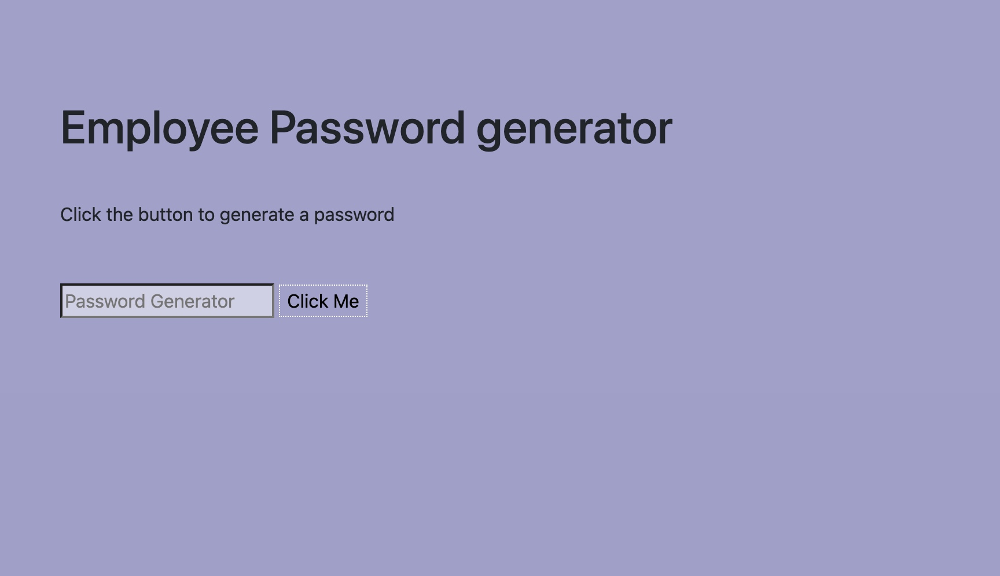

# Employee Password-Generator

Click the link to gain access to the Employee Password Generator!
https://giftyaning.github.io/Employee-Password-Generator/

# Overview

This Password Generator is a simple tool that allows users to generate strong and secure passwords based on their preferences. Whether you need a password for your online accounts, applications, or any other purpose, this tool ensures the creation of robust and customizable passwords.

# Features

Customizable Options: Tailor your passwords by choosing the length and including various elements such as uppercase letters, lowercase letters, numbers, and special characters.

Secure and Random: The generator utilizes a strong randomization algorithm to create unpredictable and secure passwords, enhancing your online security.

Easy to Use: A user-friendly interface makes it straightforward to generate passwords with just a few clicks. No complex steps – just a quick and secure way to get a strong password.

# How to Use

Open the Password Generator application.

Select your desired password length.

Choose the character sets to include in your password in the alert box (uppercase, 

lowercase, numbers, special characters).

Click the "Generate Password" button.

Your secure password will be displayed on the screen.

# Technologies Used

HTML

CSS

JavaScript
